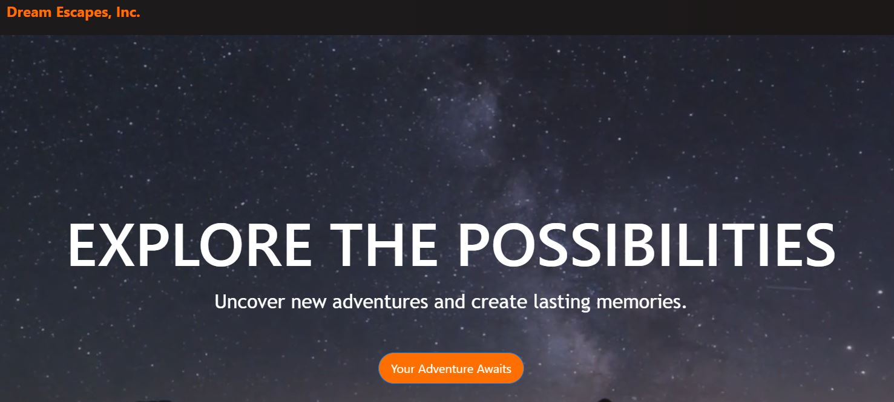

  
  
  
  

## Table of Contents (Optional)

- [Portfolio](#Portfolio)
- [Description](#Description)
- [Hosting](#Hosting)
- [Screenshot](#Screenshot)
- [Installation](#Installing)
- [Credits](#Credits)
- [License](#License)
# Portfolio

This project was bootstrapped with [Create React App](https://github.com/facebook/create-react-app).


Hosted App: https://dreamescapes.netlify.app/

## Description

As a mock company <br />
I want a business website that is catchy to viewers <br />
So that they will use the site and the business will drive more views <br />


## Hosting
Netlify hosting: https://johnne.netlify.app/


## Screenshot




## Installing & Setup

If you're looking at hosting this locally, you'll need to install NodeJS.

```shell
$ npm install
$ npm start
```

## Credits
react project ideas from: https://www.youtube.com/watch?v=I2UBjN5ER4s&ab_channel=BrianDesign
Project ideas usued from briancodex: https://github.com/briancodex/react-website-v1

## License

Please refer to the LICENSE in the repo.
